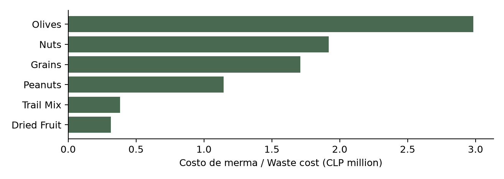

# Control de merma y reposición / Waste and replenishment control

**Camilo Vergara · Data Analyst · Caso de portafolio / Portfolio case**

Priorizar un piloto de merma en aceitunas antes de aprobar inversión en frío o emitir órdenes automáticas. La categoría concentra CLP 2.984.432 de merma valorada al costo en las cohortes simuladas.

Prioritize an olives waste pilot before approving cold-storage investment or automated orders. The category accounts for CLP 2,984,432 in simulated cohort waste at acquisition cost.

## Alcance / Scope

128 productos, 22 proveedores y 3.825 lotes simulados. Compras de julio de 2023 a junio de 2025. Los cierres llegan hasta 2035; los resultados completos no son ventas realizadas en dos años.

128 products, 22 suppliers and 3,825 synthetic batches. Purchases span July 2023 to June 2025. Closures extend to 2035; full cohort results are not two-year realized sales.

| Indicador / Metric | Resultado / Result |
|---|---:|
| Merma al costo / Waste at cost | CLP 8,992,168 |
| Merma sobre costo / Waste cost rate | 2.90% |
| Margen bruto / Gross margin | 25.03% |
| Cierres posteriores / Later closures | 498 |

## Revisar el caso / Review the case

- [Informe ejecutivo bilingüe / Bilingual executive report](reports/Executive_Report.pdf)
- [Decisión, método y límites / Decision, method and limitations](DECISION_REVIEW.md)
- [Diccionario / Data dictionary](docs/DATA_DICTIONARY.md)
- [Reproducción / Reproduction](REPRODUCIBILITY.md)
- [Verificación / Verification](docs/VALIDATION.md)
- [Excel: dashboard y tabla dinámica / dashboard and PivotTable](excel/Market_Stall_Management.xlsx)
- [Memoria del proceso ES/EN / Process memoir](docs/Process_Memoir.docx)
- [Power BI portable](reports/Market_PowerBI.zip)

## Interpretación / Interpretation

Los datos son simulados y el stock es cualitativo. Las compras no son demanda observada. No se han demostrado ahorros reales, vida útil adicional ni beneficio de un congelador. La conversión USD a 935 CLP es ilustrativa.

Data are synthetic and stock is qualitative. Purchases are not observed demand. Realized savings, added shelf life and freezer benefits have not been demonstrated. The 935 CLP/USD conversion is illustrative.
